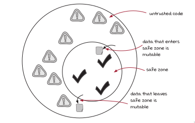

### Deep Copy
- In deep copy we make copies of all nested objects, this is different from
  shallow copy where copies objects share structural references
- We can use deep copy to make defensive copies to protect from legacy code and
  other code you don't trust
- Deep copies are favorable when refactoring legacy code.
- They enable us to make zone i.e safe zones & untrusted code regions

#### Safe Zone
- A safe zone is an are where all *we know* functions maintain immutability of our code.
- From this region we send deep copies to the untrusted region of our code.
- To this region, from our untrusted code, we also make deep copies before modifying received data.

#### Untrusted region
- This is a region where not all functions maintain immutability of our data.
- Making this zone, will enable us maintain integrity of data.

#### Defensive Copying
- This is a discipline where we make deep copies to and from the code that we don't trust.

