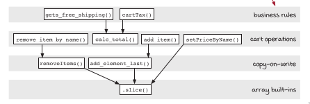

### What is Stratified Design?
- A design technique for building software in layers.
- Each layer defines new functions in terms of functions in the layers below it.
  
#### Patterns of stratified design
1. straightforward implementation:
    - When we read a function with a straightforward implementation, the problem the function signature presents should be solved at the right level of detail in the body.
    - Too much detail is a code smell

2. Abstract barrier:
    - Some layers in the graph provide an interface that lets us hide an important implementation detail.
    - These layers help us write code at a higher level and free our limited mental capacity to think at a higher level.

3. Minimal interface:
    - As our system evolves, we want the interfaces to important business concepts to converge to a small, powerful set of operations.
    - Every other operation should be defined in terms of those, either directly or indirectly.

4. Comfortable layers:
    - The code and its layers of abstraction should feel comfortable to work in.

- To understand identify layers in our design, identifying inputs/outputs is very important
- These inputs/outputs will be used as clues to help in classifying the our functions:

##### inputs
- Function Bodies:
    - Length
    - Complexity
    - Levels of detail
    - Functions called
    - Language features used
- Layer structure:
    - Arrow length
    - Cohesion
    - Level of detail
- Functional signatures:
    - Function names
    - Argument names
    - Argument values
    - Return value

##### Outputs
- Organization:
    - Decide where a new function goes
    - Move functions around
- Implementation:
    - Change an implementation
    - Extract a function
    - changes in a data structure
- Changes:
    - Choose where the new code is written
    - Decide what level of detail is appropriate

##### There are many reasons to keep the abstraction barrier minimal:
1. If we add more code to the barrier, we have more to change when we change the implementation.
2. Code in the barrier is lower level, so it’s more likely to contain bugs.
3. Low-level code is harder to understand.
4. More functions in an abstraction barrier mean more coordination between teams.
5. A larger interface to our abstraction barrier is harder to keep in your head.
